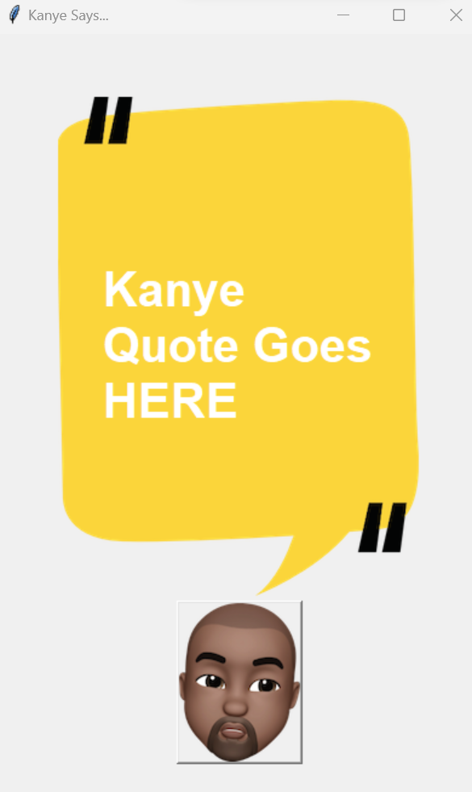

# Kanye Quotes App



## Table of Contents

- [Description](#description)
- [Features](#features)
- [Requirements](#requirements)
- [Installation](#installation)
- [Author](#author)

## Description
This is a simple application built using Python's tkinter library that fetches and 
displays Kanye West quotes using the "https://api.kanye.rest" API. The app features 
a graphical user interface with a button that, when clicked, retrieves a quote and 
displays it on the screen.

## Requirements
- Python 3.x
- `Tkinter` library (standard library)

## Features

- A window will open with the title "Kanye Says..." and a button with Kanye West's image.

- Click the button to fetch a quote from the API and display it on the screen.

## Installation
1. Clone the repository:
   ```bash
   git clone https://github.com/laurianerzb/kanye-quotes-app.git
2. Navigate to the project directory:
   ```bash 
   cd kanye-quotes-app
3. Run the program
   ```bash
   python main.py

## Author
- [laurianerzb](https://github.com/laurianerzb)
